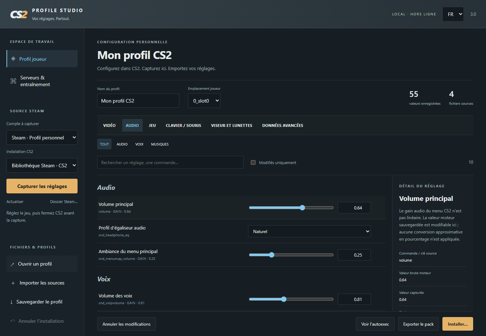

# CS2 Profile Studio

**Your settings. Everywhere.** Capture the setup you already use in Counter-Strike 2, edit it in familiar settings categories, and keep a reusable profile, autoexec and video configuration.

**English** · [Français](README.fr.md) · [Download Windows application](https://github.com/SpiRaL-network/cs2autoexec/releases/latest) · [Changelog](CHANGELOG.md)



## Get started

1. Download `CS2-Profile-Studio-3.0.0-windows-x64.zip`, extract the **whole folder**, and run `CS2 Profile Studio.exe`. Windows 10/11, x64; no Node.js installation needed.
2. Configure your settings in CS2, then **close the game** so they are saved.
3. Select the Steam account and game installation, then **Capture settings**. If detection fails, choose the Steam folder or import the source files manually.
4. Review **Video, Audio, Game, Keyboard / mouse, Crosshair & scope**, and **Advanced data**. Save a `.cs2profile` or export a bundle.

Everything works locally, without login, telemetry, cloud storage or automatic updates. The executable is unsigned. Admin rights are unnecessary when your Steam folders are writable.

## Capture and edit

Sources come from `Steam/userdata/<account>/730/local/cfg`:

| Source | Contents |
| :--- | :--- |
| `cs2_user_convars_*_slot*.vcfg` | Player preferences, HUD, radar, crosshair and other settings. |
| `cs2_user_keys_*_slot*.vcfg` | Keyboard/mouse bindings and saved analog axes. |
| `cs2_machine_convars.vcfg` | Machine-level saved console preferences, including audio and FPS limits. |
| `cs2_video.txt` | Display, resolution, refresh rate and graphics preferences. |

Every source is retained in full, including unknown and nested data. Keys such as `hud_scaling$3` and music settings ending in `$4` keep their versioned names in VCFG sources and use the actual command name in autoexec output. Select the player slot to export; other slots stay in the complete backup.

The existing game `autoexec.cfg` is captured as `original-autoexec.cfg`. Its single-line alias definitions are included in the generated autoexec. Its other commands and `exec` dependencies remain separate for review. This backs up settings, not your entire Steam account, inventory, maps, launch options, GPU driver settings or all game files.

Search by name/command, filter by category/section or modifications, edit values and supported enumerations, and reassign CS2 key names or scancodes. Duplicate keys and invalid numeric edits block export. Inspect source, raw and captured values; reset one row or all edits. Original bytes and edits are stored separately with checksums.

Engine units are preserved. Audio values marked **GAIN** use the saved nonlinear gain; no approximate menu-percentage conversion is applied. Unsupported video values and device IDs stay visible as source data. The crosshair preview is schematic.

## Export

Each bundle contains:

- `autoexec.cfg`: recognized archived player commands suitable for a portable CFG; no supplied player defaults or practice shortcuts.
- `cs2_video.txt`, when captured: the complete edited video source, including its hardware/display values.
- `profile.cs2profile`: reopen, edit, install and export again.
- `raw-source/` and `edited-source/`: complete originals and files with your edits.
- `manifest.json` with checksums and omission report, plus installation notes.

Development-only, protected, replicated, account/device-specific and unrepresentable CFG entries remain in the full sources. They are not silently discarded from the profile.

For manual loading, copy the autoexec to `game/csgo/cfg`, enable the CS2 developer console and run `exec autoexec.cfg`. Use `+exec autoexec.cfg` in Steam launch options to request startup loading. An autoexec reapplies settings when executed; it **does not permanently lock** the game menus.

## Install and restore

Select the **destination** account and game installation, then **Install…**:

| Mode | Behavior |
| :--- | :--- |
| Portable settings | Installs autoexec and merges recognized graphics preferences into the target video file. Keeps target GPU identity, hardware tuning, display, resolution and refresh rate. Display preferences can be transferred explicitly. Launch CS2 once on a new target account to create its video file. |
| Full source restore | Installs all captured/edited VCFG and video sources plus autoexec. Intended for the same PC; includes machine/account preferences. |

Both modes preview the exact files, back up existing files, and stop if a target changed after preview. **Undo installation** restores the last backup and removes files created by the installation. It stops if installed files changed afterwards. Backups remain in `%APPDATA%/cs2-profile-studio/backups`.

CS2 must be closed. Steam Cloud can synchronize a different copy on the next launch; review any conflict. The game folder's autoexec is shared by accounts using that installation. Portable mode does not apply every source-only preference: keep the complete profile for recovery.

## Server configurations

The separate **Servers & practice** workspace generates editable CFG bundles for local practice and vanilla surf, bunnyhop and KZ movement sandboxes. Commands/ranges are checked against the CS2 catalogue dated **2026-10-05**. Gameplay values are starting points, not league or community rulesets, and have not been play-tested inside CS2.

KZ exports also include a separate configuration derived from [CS2KZ upstream](https://github.com/KZGlobalTeam/cs2kz-metamod/blob/master/cfg/cs2kz.cfg), with setup notes. A complete KZ server needs [CS2KZ](https://github.com/KZGlobalTeam/cs2kz-metamod), Metamod and its documented dependencies. Let the plugin control its movement mode; do not combine its config with the vanilla KZ sandbox. Surf/bhop timers and checkpoints likewise require suitable maps and plugins.

The application generates files; it does not deploy plugins, host a server or configure networking. Load a suitable map on your own server, then execute the exported CFG as described in its README.

## Development

Node.js **22.12+**, npm and Windows for the desktop smoke test / release build:

```sh
npm ci
npm test
npm start
npm run test:ui
npm run dist
```

Tests cover complete source preservation, versioned keys, edits, slots, rebinding, video merging, export, transactional installation and guarded rollback. The Electron smoke test uses synthetic Steam/game folders, never your real CS2 installation. CI runs core tests on Linux/Windows and the desktop test on Windows.

Menu/control metadata is derived from [GameTracking-CS2](https://github.com/SteamTracking/GameTracking-CS2/tree/master/game/csgo/pak01_dir/panorama/layout/settings) and its command dump. No original game artwork or menu XML is shipped. Refresh the catalogue with [tools/generate-catalog.py](tools/generate-catalog.py). Commands and file formats can change with game updates.

Original presets, script installer and browser editor remain available: [legacy guide](docs/legacy-en.md), [`autoexec.cfg`](autoexec.cfg), [`pracc.cfg`](pracc.cfg), [`editor/index.html`](editor/index.html), [key reference](SCANCODES.md). They are independent of captured desktop profiles.

Independent project by SpiRaL, [MIT license](LICENSE), not affiliated with Valve. Third-party runtime notices are included in the Windows distribution.
