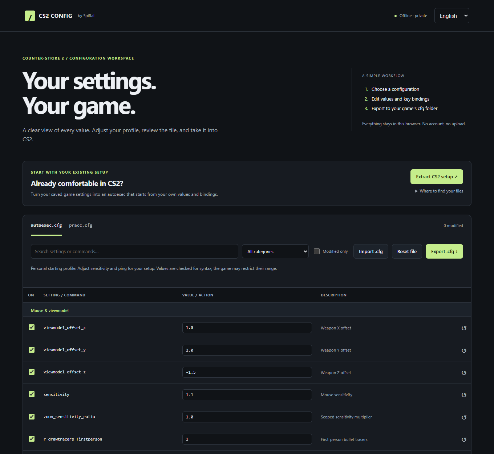

# CS2 Autoexec

Une configuration Counter-Strike 2 lisible, modifiable et accompagnée d’un profil d’entraînement local. Les réglages de SpiRaL servent de point de départ : adaptez-les à votre matériel et à vos préférences.

[English](legacy-en.md) · **Français** · [Tableau de configuration](../editor/index.html) · [Référence des touches](../SCANCODES.md)

| Fichier | Rôle |
| :--- | :--- |
| [`autoexec.cfg`](../autoexec.cfg) | Sensibilité, réseau, audio, interface, viseur et raccourcis. |
| [`pracc.cfg`](../pracc.cfg) | Paramètres d’un serveur d’entraînement local et outils de grenade. |
| [`editor/index.html`](../editor/index.html) | Tableau interactif hors ligne pour modifier et exporter les deux fichiers. |
| [`install.bat`](../install.bat) | Installation Windows avec détection de Steam et sauvegarde des fichiers existants. |



## Personnaliser

### Partir de son setup CS2 actuel

Ouvrez le tableau hors ligne, puis cliquez sur **Extraire mon setup CS2**. Fermez d’abord CS2 pour que les fichiers reflètent ses réglages enregistrés. Dans le dossier d’installation de Steam, ouvrez :

```text
userdata/<compte>/730/local/cfg
```

Sélectionnez ensemble `cs2_user_convars_0_slot0.vcfg` et `cs2_user_keys_0_slot0.vcfg`. Vous pouvez ajouter `cs2_machine_convars.vcfg` pour les réglages console de la machine. Les fichiers doivent venir du même compte et du même profil utilisateur. Si votre profil actif porte d’autres numéros, choisissez sa paire de fichiers correspondante.

Le tableau génère un autoexec **uniquement à partir de vos valeurs et raccourcis enregistrés**. Il ne complète pas les valeurs absentes avec le profil SpiRaL et n’ajoute pas de raccourcis d’entraînement. Les noms de touches restent ceux enregistrés ; les axes de souris sont inclus lorsqu’ils sont présents. Les valeurs utilisateur sont prioritaires sur celles de la machine, quel que soit l’ordre de sélection. Le rapport indique les entrées omises, les valeurs répétées et l’absence éventuelle du fichier de réglages ou de touches. Vérifiez le résultat, ajustez-le si besoin, puis exportez `autoexec.cfg`.

L’extraction concerne les réglages console sauvegardés et ne constitue pas une sauvegarde complète du jeu. Les réglages absents des fichiers sélectionnés restent absents. Gardez à part les définitions d’alias de vos anciens `.cfg` : le fichier de touches peut y faire référence sans contenir leurs définitions. `cs2_video.txt` n’est pas converti ; les valeurs nécessitant des guillemets échappés, antislashs ou caractères de contrôle sont omises et signalées. Vos fichiers de jeu sont uniquement lus et restent sur votre ordinateur.

### Partir du profil fourni ou d’un .cfg existant

**Avec le tableau :** [téléchargez le dépôt](https://github.com/SpiRaL-network/cs2autoexec/archive/refs/heads/main.zip), décompressez-le, puis ouvrez `editor/index.html` dans votre navigateur. Le lien GitHub affiche le code HTML ; l’application s’ouvre depuis le dossier téléchargé.

Choisissez votre langue et votre fichier. Recherchez une commande ou filtrez par catégorie. Modifiez une valeur, réattribuez une touche ou désactivez une ligne. Vérifiez l’aperçu, puis cliquez sur **Exporter le .cfg**. Vous pouvez aussi importer un fichier existant : les valeurs entre guillemets sont modifiables, les autres lignes sont conservées.

Le tableau ne nécessite ni installation, ni connexion, ni compte. Les imports et modifications restent dans la page jusqu’à sa fermeture ou son rechargement : exportez les fichiers pour les conserver. La validation porte sur la syntaxe, pas sur toutes les plages de valeurs ni sur la disponibilité des commandes dans votre version du jeu. Les commandes ou touches en double sont signalées ; la dernière ligne est prioritaire.

**Avec un éditeur de texte :** les tableaux de `autoexec.cfg` et `pracc.cfg` contiennent les commandes réellement exécutées. Modifiez la valeur entre guillemets. Il n’existe pas de deuxième tableau de valeurs à synchroniser.

<!-- defaults:start -->
| Réglage du profil | Valeur | Commande |
| :--- | :--- | :--- |
| Sensibilité de la souris | `1.1` | `sensitivity` |
| Multiplicateur de sensibilité avec lunette | `1.0` | `zoom_sensitivity_ratio` |
| Ping maximal en matchmaking (ms) | `25` | `mm_dedicated_search_maxping` |
| Échelle de l’interface | `0.9` | `hud_scaling` |
| Zoom de la carte du radar | `0.4` | `cl_radar_scale` |
| Seuil d’alerte du temps d’image (ms) | `4.2` | `cl_hud_telemetry_frametime_poor` |
<!-- defaults:end -->

La sensibilité dépend aussi du DPI de la souris. Un ping maximal de 25 ms peut limiter les régions accessibles. Un seuil de temps d’image de 4,2 ms correspond à environ 238 FPS et peut déclencher des alertes fréquentes. Ces valeurs décrivent le profil fourni ; ce ne sont pas des recommandations universelles.

## Installer

1. Dans Steam, ouvrez **CS2 → Gérer → Parcourir les fichiers locaux**.
2. Allez dans `game/csgo/cfg`.
3. Sauvegardez vos fichiers existants, puis copiez `autoexec.cfg` et `pracc.cfg` dans ce dossier. Si vous utilisez le tableau, copiez les fichiers exportés.

Sous Windows, `install.bat` détecte le dossier de jeu dans les bibliothèques Steam et copie les deux `.cfg` situés à côté du script. S’ils existent déjà à destination, il les sauvegarde dans un sous-dossier horodaté avant de les remplacer. Aucun droit administrateur n’est nécessaire. Pour installer vos exports avec le script, remplacez d’abord les `.cfg` dans le dossier téléchargé.

Sous Linux, utilisez l’installation manuelle depuis le dossier du jeu ouvert par Steam. Le tableau fonctionne dans un navigateur moderne sur les deux systèmes.

## Charger dans CS2

Activez **Paramètres → Jeu → Activer la console développeur**. Dans la console :

```text
exec autoexec.cfg
```

Pour demander explicitement le chargement à chaque démarrage, ajoutez `+exec autoexec.cfg` aux options de lancement Steam. CS2 peut également charger automatiquement un fichier nommé `autoexec.cfg` dans son dossier `cfg` : l’absence de cette option ne garantit donc pas un chargement ponctuel. Pour un profil uniquement manuel, renommez-le en `personal.cfg`, puis utilisez `exec personal.cfg`.

Rechargez le fichier après l’avoir modifié. Les réglages enregistrés par le jeu peuvent persister ; charger une configuration n’offre pas de restauration automatique du profil précédent. `host_writeconfig` reste une commande facultative à lancer vous-même pour enregistrer les réglages du jeu.

## Raccourcis

Les scancodes désignent des **positions physiques**, compatibles notamment avec les touches WASD en QWERTY américain et ZQSD en AZERTY français. Les inscriptions peuvent varier sur d’autres dispositions. Les raccourcis non définis par ce profil restent ceux de votre configuration de jeu actuelle.

<!-- bindings:start -->
| Action | QWERTY | AZERTY | Config key |
| :--- | :--- | :--- | :--- |
| Sortir rapidement le couteau | C | C | `scancode6` |
| Avancer | W | Z | `scancode26` |
| Reculer | S | S | `scancode22` |
| Déplacement à gauche | A | Q | `scancode4` |
| Déplacement à droite | D | D | `scancode7` |
| Sauter | Space | Espace | `scancode44` |
| S’accroupir | Left Ctrl | Ctrl gauche | `scancode224` |
| Marcher | Left Shift | Maj gauche | `scancode225` |
| Tir principal | MOUSE1 | MOUSE1 | `MOUSE1` |
| Tir secondaire | MOUSE2 | MOUSE2 | `MOUSE2` |
| Lâcher l’arme | MOUSE4 | MOUSE4 | `MOUSE4` |
| Revenir à l’arme précédente | MOUSE5 | MOUSE5 | `MOUSE5` |
| Sauter avec la molette vers le haut | MWHEELUP | MWHEELUP | `MWHEELUP` |
| Sauter avec la molette vers le bas | MWHEELDOWN | MWHEELDOWN | `MWHEELDOWN` |
| Sélectionner une flash | Q | A | `scancode20` |
| Sélectionner un fumigène | F | F | `scancode9` |
| Sélectionner une grenade HE | V | V | `scancode25` |
| Sélectionner un molotov/incendiaire | MOUSE3 | MOUSE3 | `MOUSE3` |
| Utiliser / interagir | E | E | `scancode8` |
| Recharger | R | R | `scancode21` |
| Ouvrir le menu d’achat | B | B | `scancode5` |
| Ouvrir le choix d’équipe | M | , | `scancode16` |
| Ping contextuel | Left Alt | Alt gauche | `scancode226` |
| Inspecter l’arme | G | G | `scancode10` |
| Changer de main | X | X | `scancode27` |
| Ouvrir le menu des graffitis | Delete | Suppr | `scancode76` |
| Maintenir pour parler | T | T | `scancode23` |
| Discussion générale | Y | Y | `scancode28` |
| Discussion d’équipe | U | U | `scancode24` |
| Menu radio | Z | W | `scancode29` |
| Commandes radio (touche ISO) | ISO \ | ISO < | `scancode100` |
| Achat automatique | F1 | F1 | `scancode58` |
| Racheter l’équipement précédent | F2 | F2 | `scancode59` |
| Voter OUI | F3 | F3 | `scancode60` |
| Voter NON | F4 | F4 | `scancode61` |
| Charger la configuration d’entraînement | F11 | F11 | `scancode68` |
| Afficher / masquer la console | F9 | F9 | `scancode66` |
| Basculer le zoom du radar | Caps Lock | Verr. Maj | `scancode57` |
<!-- bindings:end -->

`Mouse4` et `Mouse5` nécessitent des boutons latéraux. Si votre souris n’en possède pas, réattribuez **drop** et **lastinv** à des touches libres. `scancode100` correspond à la touche supplémentaire des claviers ISO, absente des claviers ANSI américains ; désactivez-la ou réattribuez-la. Le tableau permet ces adaptations, et [SCANCODES.md](../SCANCODES.md) donne la référence complète.

## Entraînement local

Ouvrez une carte locale, puis appuyez sur **F11** ou tapez `exec pracc.cfg`. Le fichier configure 60 000 $ de départ, l’achat partout, des manches de 60 minutes, la réapparition des deux équipes, des munitions sans rechargement, les trajectoires de grenades et les impacts de balle. Il retire les bots et redémarre la manche après une seconde.

| Touche | Action |
| :--- | :--- |
| F5 | Activer ou désactiver le vol libre (`noclip`). |
| F6 | Relancer la dernière grenade. |
| F7 | Ajouter et placer un bot sous le viseur. |

`sv_infinite_ammo "1"` fournit des munitions sans rechargement ; utilisez `"2"` pour conserver le rechargement. Le bunnyhop automatique modifie le déplacement par rapport aux serveurs compétitifs. L’accélération aérienne n’est pas modifiée. `god "1"` demande l’invulnérabilité ; sa disponibilité et son effet dépendent du jeu. Le fichier d’entraînement ne crée pas de serveur et nécessite le contrôle du serveur pour modifier les paramètres protégés. Rechargez une carte ou une session normale pour sortir de cet environnement.

## Maintenance

Les `.cfg` à la racine sont la source de référence du profil fourni. Après une modification, régénérez les valeurs intégrées au tableau et les tableaux de documentation avec Node.js 18 ou plus récent :

```sh
node tools/sync-editor.js
node --test tests/*.test.js
node tools/sync-editor.js --check
```

Les vérifications portent sur la synchronisation, l’import/export et la syntaxe ; elles ne lancent pas CS2. Les commandes peuvent évoluer avec les mises à jour. Les anciennes commandes audio réservées au développement ont été retirées du profil actif. Voir [CHANGELOG.md](../CHANGELOG.md).

## Projet

Projet indépendant de [SpiRaL](https://steamcommunity.com/id/theogspiral), distribué sous [licence MIT](../LICENSE). Sans affiliation avec Valve. Les fichiers utilisent la console du jeu ; les commandes d’entraînement protégées nécessitent `sv_cheats` et le contrôle du serveur. Cette configuration n’est pas une certification par Valve.
